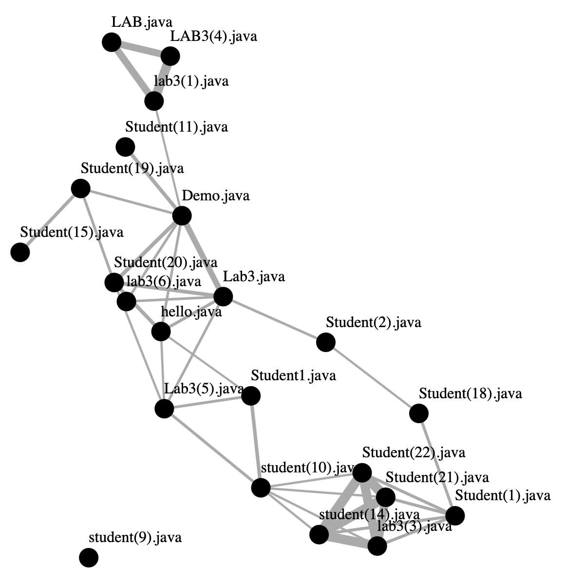

# MossViz
Visualizing [Moss (Measure Of Software Similarity)](http://moss.stanford.edu) result in a node-link diagram

## How to Use
Just open up `index.html` to see the visualization. It will open an example data file `Moss Results.html` which can be saved directly from the website.

## Visualization
This standard node-link diagram is implemented with [D3](https://d3js.org). Each node is a submission shown with its filename. An edge links two submissions that are more similar than the average of the macthed lines of all submission pairs (visualized as edge thickness). Cliques of plagiarism should be easily detectable.

A simple bounded force layout is applied. Nodes can also be dragged around and fixed for manual layout. An example is shown below.

